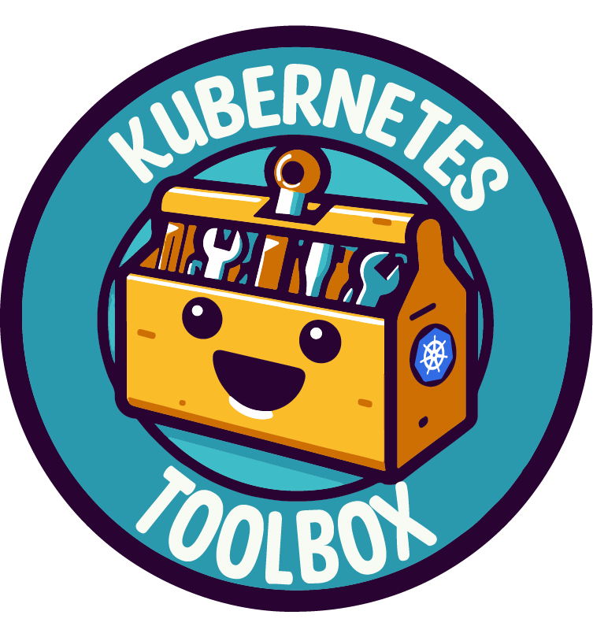

<p align="center">
  
</p>


# Kubernetes Toolbox

Simplify and enhance your Kubernetes management experience on Azure with our comprehensive toolbox Docker image. This ready-to-use solution bundles a suite of powerful tools, carefully selected to streamline your workflows.

[](https://github.com/antnsn/kube-mgmt/actions/workflows/build.yml)

## Included Tools

- **Azure CLI:** Seamlessly manage Azure resources directly from your Kubernetes environment.
- **kubectl:** Command-line tool for interacting with Kubernetes clusters.
- **kubelogin:** Facilitates Azure Active Directory authentication within Kubernetes.
- **k9s:** A terminal-based UI that simplifies Kubernetes cluster monitoring and management.
- **Helm:** Accelerate Kubernetes application deployment with Helm charts.
- **crictl:** Container runtime interface for Kubernetes, offering essential container management capabilities.
- **trivy:** Enhance container security with comprehensive image vulnerability scanning.
- **kube-bench:** Conduct security benchmarking for Kubernetes configurations to ensure best practices.
- **K8Sgpt:** A tool for scanning your Kubernetes clusters, diagnosing, and triaging issues in simple English.
- **Netfetch:** A tool designed to scan Kubernetes namespaces for network policies, checking if your workloads are targeted by a network policy or not.

## How to Use

This Docker image provides a one-stop solution for your Kubernetes needs. Simply pull the image and start leveraging these tools immediately:

```bash
docker pull antnsn/kubernetes-toolbox:latest
docker run -it antnsn/kubernetes-toolbox:latest
```

### Existing kube config

If you have an existing kube config file, you can easily integrate it with our Azure Kubernetes Toolbox. Simply volume map the `fileLocation` to `~/.kube/config` using the following command:

```bash
docker run -v /path/to/your/.kube::/home/k8s-toolbox/.kube/ -it antnsn/kubernetes-toolbox:latest
```

### Full run with exposed ports, .kube map:
```bash
docker run -p 8088:8088 -p 8087:8087 -p 8086:8086 -p 8085:8085 -v /path/to/your/.kube:/home/k8s-toolbox/.kube/ --name kubernetes-toolbox -it antnsn/kubernetes-toolbox:latest
```

### Access the container in your terminal into the container: 

```bash
docker exec -it kubernetes-toolbox /bin/bash
```


### Exposed Ports

The Docker image exposes the following ports, providing flexibility for your applications:

- **8088**
- **8087**
- **8086**
- **8085**


## Customization
You can customize this Dockerfile to add or remove specific tools or dependencies according to your project requirements.

